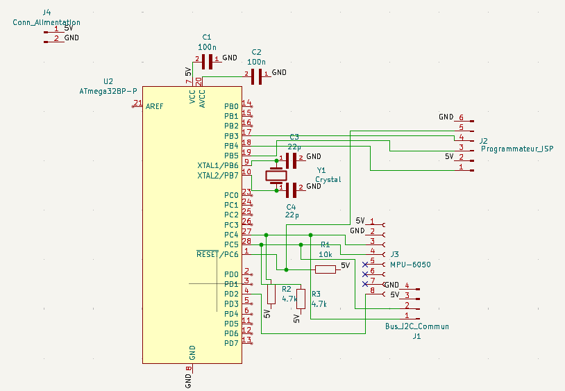
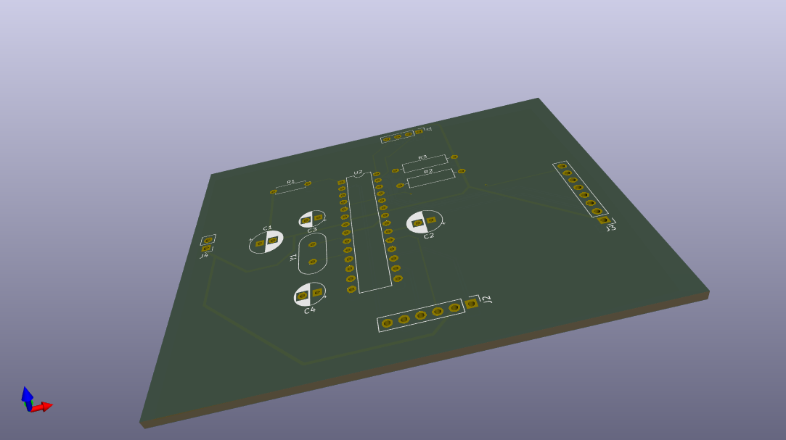
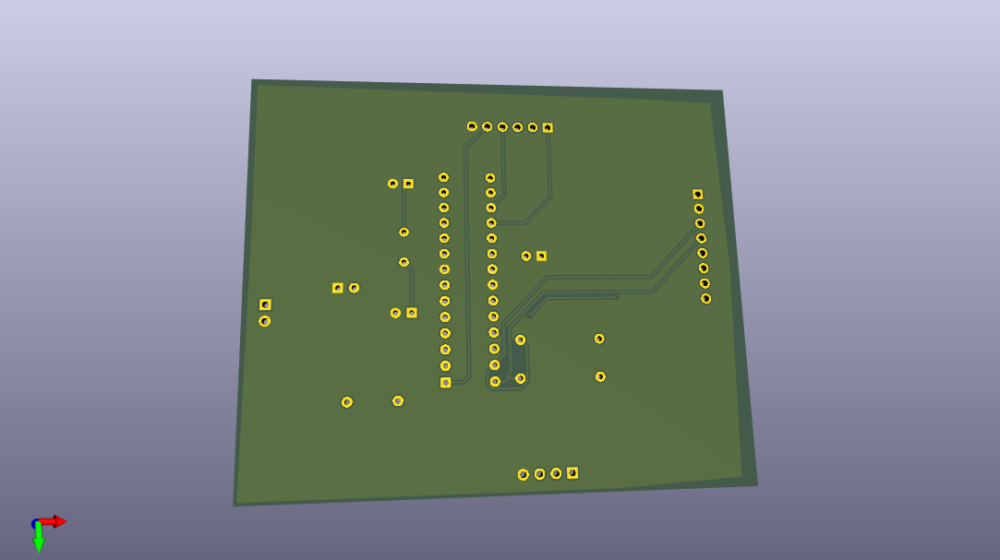
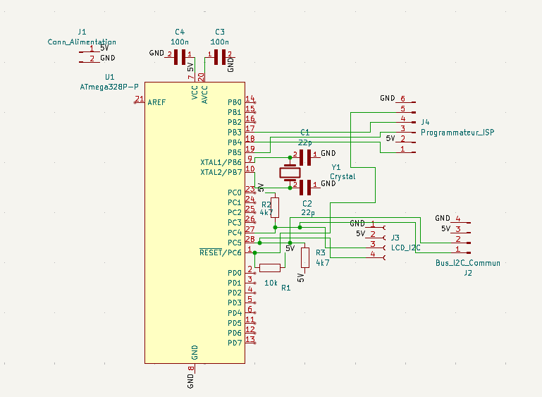
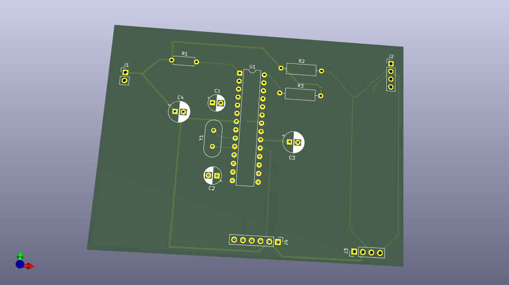
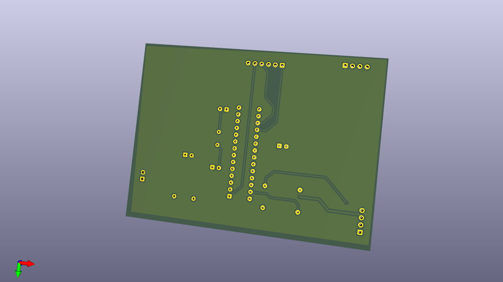

# Assembly and Configuration Guide - BlackBox & Control Station

This guide provides step-by-step instructions for assembling the "BlackBox" and "Control Station" modules and configuring them for proper operation.

---

### 1. Development Environment Setup

The Arduino IDE development environment must be configured:

* **Download and install the Arduino IDE** from [https://www.arduino.cc/en/software](https://www.arduino.cc/en/software).
* **Install necessary libraries** via the IDE's "Library Manager" (`Sketch > Include Library > Manage Libraries...`):
    * `Adafruit MPU6050`
    * `Adafruit Unified Sensor` (MPU6050 dependency)
    * `LiquidCrystal I2C` (by Frank de Brabander)

---

### 2. BlackBox Module Assembly

The "BlackBox" module includes an ATmega328P microcontroller (or Arduino Uno board for prototyping) and the MPU-6050 sensor.

#### Wiring Diagram (Breadboard Prototyping)

This diagram illustrates the minimum connections for the BlackBox to function on a breadboard.

* **ATmega328P (on Arduino Uno board or standalone)**
* **MPU-6050**
    * `VCC` -> `5V` (or `3.3V` if the MPU-6050 module is 3.3V compatible)
    * `GND` -> `GND`
    * `SDA` -> `A4` (or dedicated `SDA` if standalone ATmega328P)
    * `SCL` -> `A5` (or dedicated `SCL` if standalone ATmega328P)
    * `INT` -> `D2` (for Data Ready interrupt)

* **BlackBox KiCad Schematic**:
    
    *KiCad File*: [`hardware/cube_pcb/cube_pcb.kicad_sch`](hardware/cube_pcb/cube_pcb.kicad_sch)

* **BlackBox 3D PCB Visualization**:
    
    
    *KiCad File*: [`hardware/cube_pcb/cube_pcb.kicad_pcb`](hardware/cube_pcb/cube_pcb.kicad_pcb)

* **Prototyping Assembly Photo**:
    

#### Uploading BlackBox Firmware

1.  Open the [`cube_firmware.ino`](firmware/cube_firmware/cube_firmware.ino) file in the Arduino IDE.
2.  Ensure the correct board (e.g., "Arduino Uno") and COM/USB port are selected.
3.  Click "Upload" (right arrow button) to compile and send the code to the microcontroller.

---

### 3. Control Station Module Assembly

The "Control Station" module includes an ATmega328P microcontroller (or Arduino Uno board) and an I2C LCD screen.

#### Wiring Diagram (Breadboard Prototyping)

This diagram illustrates the minimum connections for the Control Station to function on a breadboard.

* **ATmega328P (on Arduino Uno board or standalone)**
* **I2C LCD Screen**
    * `VCC` -> `5V`
    * `GND` -> `GND`
    * `SDA` -> `A4` (or dedicated `SDA` if standalone ATmega328P)
    * `SCL` -> `A5` (or dedicated `SCL` if standalone ATmega328P)

* **Control Station KiCad Schematic**:
    
    *KiCad File*: [`hardware/station_pcb/station_pcb.kicad_sch`](hardware/station_pcb/station_pcb.kicad_sch)

* **Control Station 3D PCB Visualization**:
    
    
    *KiCad File*: [`hardware/station_pcb/station_pcb.kicad_pcb`](hardware/station_pcb/station_pcb.kicad_pcb)

* **Prototyping Assembly Photo**:
    

#### Uploading Control Station Firmware

1.  Open the [`station_firmware.ino`](firmware/station_firmware/station_firmware.ino) file in the Arduino IDE.
2.  Ensure the correct board and COM/USB port are selected.
3.  Click "Upload".

---

### 4. I2C Address Configuration

* Verify that the I2C address defined for the Control Station in the code (`STATION_ADDRESS`) matches the one used by the BlackBox for data transmission. By default, it is set to `8`.
    ```cpp
    // In cube_firmware.ino and station_firmware.ino
    const int STATION_ADDRESS = 8;
    ```
    If a full Arduino Uno board is used, SDA (A4) and SCL (A5) pins are generally standard. If the ATmega328P is used standalone, pins A4 and A5 must be connected to SDA and SCL.

---

### 5. Powering the Modules

* Both modules (BlackBox and Control Station) require a stable 5V power supply.
* The grounds (GND) of both modules must be interconnected to ensure proper I2C communication.