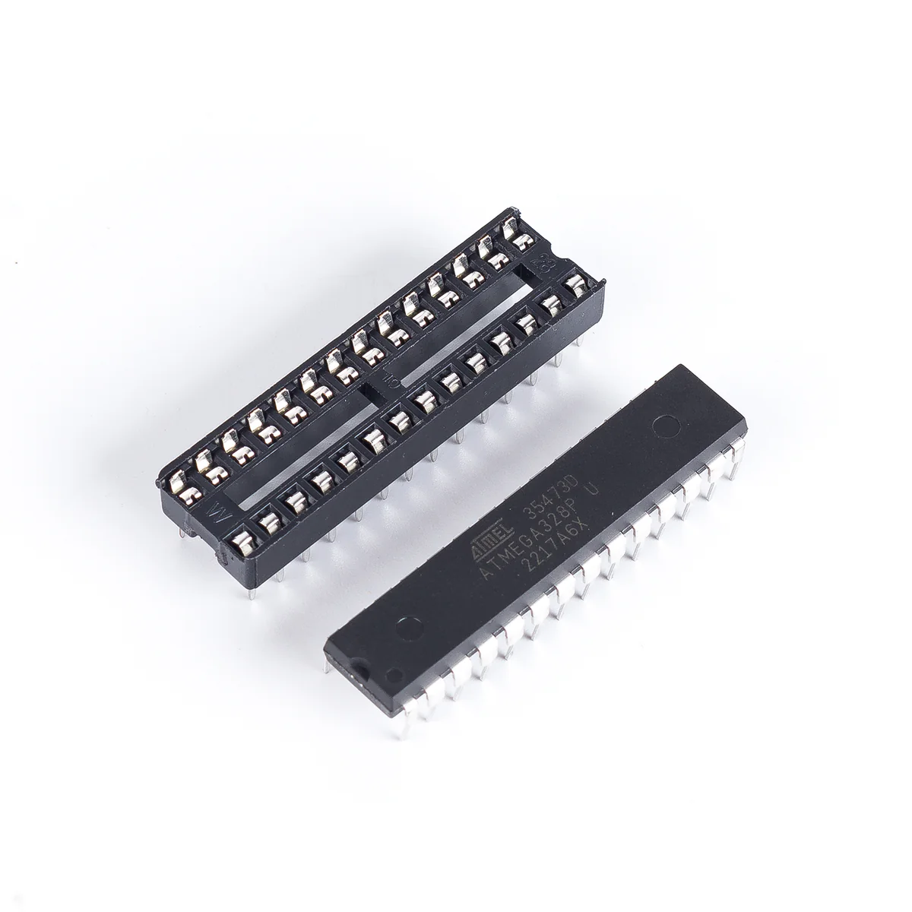
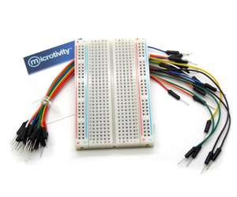
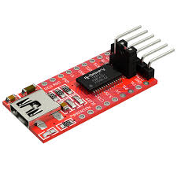
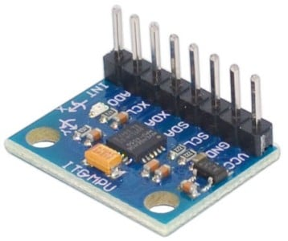
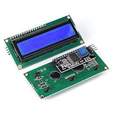
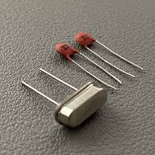
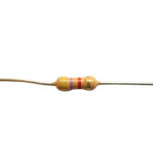

# Hardware Used - BlackBox & Control Station

This project relies on standard and accessible electronic components. Below is a detailed list of the hardware required to build and implement the "BlackBox & Control Station" system.

---

### 1. Key Components Common to Both Modules:

* **ATmega328P Microcontroller**
    * **Description**: The core of each module, responsible for executing the firmware. For prototyping, an Arduino Uno board can be used.
    * **Datasheet**: [ATmega328P Datasheet](https://ww1.microchip.com/downloads/en/DeviceAtmel-7810-Automotive-Microcontrollers-ATmega328P_Datasheet.pdf)
    
* **Breadboards & Jumper Wires**
    * **Description**: For initial prototyping and temporary interconnections.
    
* **USB to Serial Adapter (FTDI or Arduino Uno as programmer)**
    * **Description**: Essential for code uploading and serial communication (debugging) with standalone ATmegas.
    * **Datasheet (FT232RL example)**: [FT232RL Datasheet](https://ftdichip.com/wp-content/uploads/2020/08/DS_FT232R.pdf)
    

---

### 2. Components Specific to the BlackBox:

* **MPU-6050 Sensor Module (Gyroscope + Accelerometer)**
    * **Description**: The 6 DOF (Degrees of Freedom) sensor that provides orientation and acceleration data for flight and crash detection.
    * **Datasheet (MPU-6050 Chip)**: [MPU-6050 Datasheet](https://www.cdiweb.com/datasheets/invensense/MPU-6050_DataSheet_V3.4.pdf)
    

---

### 3. Components Specific to the Control Station:

* **LCD 16x2 or 20x4 Screen with I2C Module**
    * **Description**: The visual interface for real-time display of flight data and crash status. The I2C adapter greatly simplifies wiring.
    * **Datasheet (HD44780 Example)**: [HD44780 Datasheet](https://www.sparkfun.com/datasheets/LCD/HD44780.pdf)
    * **Datasheet (PCF8574 I2C Example)**: [PCF8574 Datasheet](https://www.ti.com/lit/ds/symlink/pcf8574.pdf)
    

---

### 4. Components for PCB Design (if applicable):

* **16 MHz Crystal and 22 pF Capacitors (if standalone ATmega328P)**
    * **Description**: Necessary for stable clock operation of the ATmega328P when used alone on a custom PCB.
    
* **Pull-up Resistors (4.7kΩ, for I2C if not integrated into modules)**
    * **Description**: Ensure the correct idle voltage on the SDA and SCL lines of the I2C bus.
    