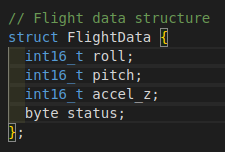

# Software (Firmware) - BlackBox & Control Station

The core of this project lies in the embedded firmware, developed with the Arduino IDE for ATmega328P microcontrollers. The code is structured to maximize clarity and modularity.

The complete source code is available in the [`firmware/`](firmware/) folder.

---

### 1. BlackBox Firmware (`cube_firmware.ino`)

* **Path**: [`firmware/cube_firmware/cube_firmware.ino`](firmware/cube_firmware/cube_firmware.ino)
* **Main Role**: MPU-6050 data acquisition, crash detection, saving critical data to EEPROM, and I2C transmission to the Control Station.

#### Key Functions and Their Roles:

* **`setup()`**: Initializes the MPU-6050 and the I2C bus. Manages the autonomous system reset logic after a crash (detected by a power cycle) and configures the MPU-6050's "Data Ready" interrupt.
* **`loop()`**: The program's core. Continuously reads data from the MPU-6050, applies crash detection logic, manages recording in the EEPROM circular buffer, and sends data to the Control Station via I2C.
* **`FlightData` (structure)**: Defines the structure of data (Roll, Pitch, Accel Z, Status) exchanged between the BlackBox and the Control Station.
    
* **`handleSerialRecovery()`**: Allows retrieving data recorded in EEPROM via the serial port after a crash, upon sending a specific command.
* **`handleMPUInterrupt()`**: Interrupt service routine for the MPU-6050 (sets a flag for data reading).

---

### 2. Control Station Firmware (`station_firmware.ino`)

* **Path**: [`firmware/station_firmware/station_firmware.ino`](firmware/station_firmware/station_firmware.ino)
* **Main Role**: Receiving I2C data from the BlackBox and displaying it on the LCD screen.

#### Key Functions and Their Roles:

* **`setup()`**: Initializes the microcontroller as an I2C slave and configures the LCD screen.
* **`loop()`**: Manages the LCD display update based on received data and crash status (Normal or "CRASH !!!").
* **`receiveEvent(int numBytes)`**: I2C callback function. It is automatically called when data is received from the BlackBox and reads it into the `FlightData` structure.
* **`FlightData` (structure)**: Uses the same structure as the BlackBox to correctly interpret received data.